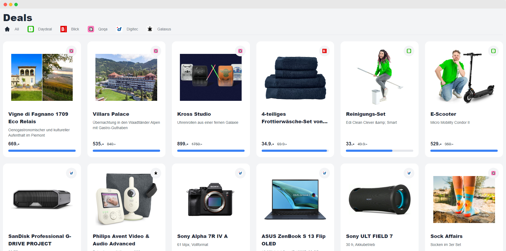

# Deals
Show current deals from various deal-pages. Refresh every x minutes automatically.

<p align="center">

</p>

## What it does
Crawls different platforms from switzerland for deals and displays them on a responsive webpage.
- First person which registers, is the only person to be able to register/login and manage deals.
- See /register,/login for user setup

## Getting Started
Assuming you've already installed on your machine: PHP (>= 8.1.0), [Laravel](https://laravel.com), [Composer](https://getcomposer.org) and [Node.js](https://nodejs.org).

Install dependencies
```bash
composer install
npm install
```

Create .env file and generate the application key
```bash
cp .env.example .env
php artisan key:generate
```

Build CSS and JS assets
```
npm run dev
# or, if you prefer minified files
npm run prod
```

Run workers & serve application
```bash
php artisan queue:work
php artisan scheduler:work
php artisan serve
```

## Created with
<!-- Check https://github.com/alexandresanlim/Badges4-README.md-Profile -->


